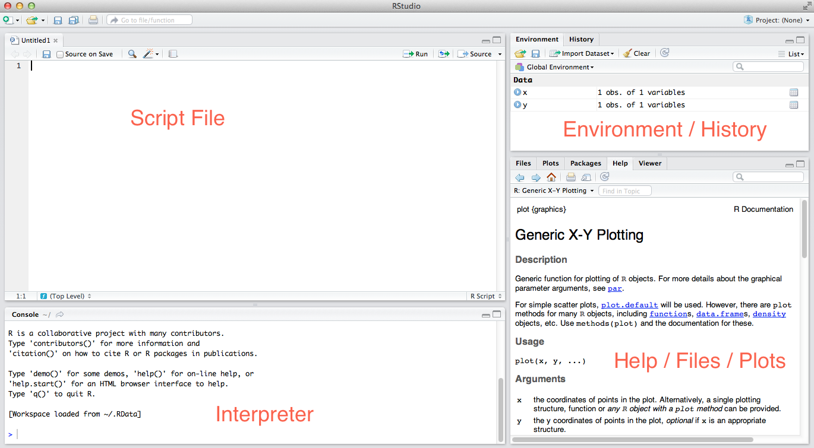

We will be relying heavily on a piece of software called Rstudio. There are a [ton of reasons](http://www.ancienteco.com/2013/02/top-6-reasons-you-need-to-be-using.html) to use Rstudio.  It includes a lot of time-saving features!  There are four main sections of the screen: 

* **interpreter** - This is R.  Type in a command and it gets executed.  You should use this as your sandbox -- an experimental place to figure out WHAT you want to do, but not necessarily to actually DO what you want to do. 
* **script** - This is where you DO what you want to do.  This is just a regular plain text file with the .R file extension. Scripting is THE REASON to use R.  It provides an exact record of what you did, so that you can recreate each step of the analysis exactly.  
    *  **Remember** - Never, Ever do something important only in the interpreter: do it in the script, save it, and then send it to the interpreter!
* **files/plots/help** - this is where you can see the files in the current project, and where plots appear, and where the help pops up when you type `?plot`.
* **environment/history** - This shows the current variables in memory, and a history of commands executed in the interpreter.  Don't mistake the history for something like a record of your analysis...this will include every command executed, including the mistakes. 

## Project Files
I would highly recommend using the "Projects" feature of Rstudio.  This isolates all your files related to a particular projet in a single directory, and it also takes care of setting your working directory: this means you can often avoid typing `/Users/wabarr/Projects/myProject/datafile.txt` and instead just type `datafile.txt`. 

## R Markdown
This feature is incredible.  Instead of doing regular .R script files, you can create a special type of script file called an R markdown file, which allows you to mix human readable text with snippets of R code. At any point you can "knit" the R Markdown file, at which point the code snippets get run, and any results (figures, text output) gets combined with the human readable comments, and knit into a single pdf, word doc or html file.  This is how I work mostly....basically writing the methods section of a paper interactively as I write the analysis code.  

### Example R Markdown document

### Output of R Markdown after knitting

